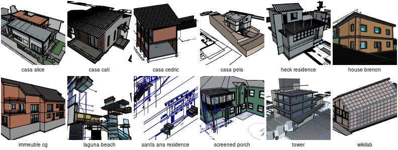

This repo contains a collection of FreeCAD files containing BIM models
made in collaboration with [Uncreated](https://uncreated.net), [OpeningDesign](https://openingdesign.com) and [Luc Nelles Architectes](https://www.luc-nelles.be/) over the years.

Everything is licensed under [Attribution-ShareAlike 4.0 International (CC BY-SA 4.0)](https://creativecommons.org/licenses/by-sa/4.0/). Feel free to open, analyze and reuse, as long as you respect the terms of the license (you must cite me when reusing or sharing any of the files here, and modified files must be shared under the same license)!
